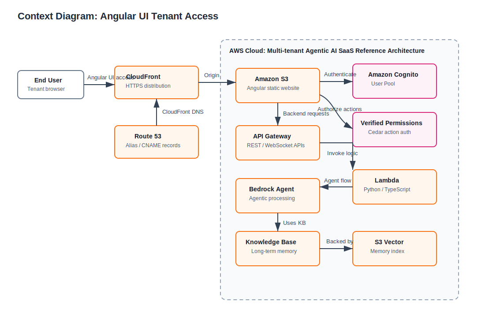
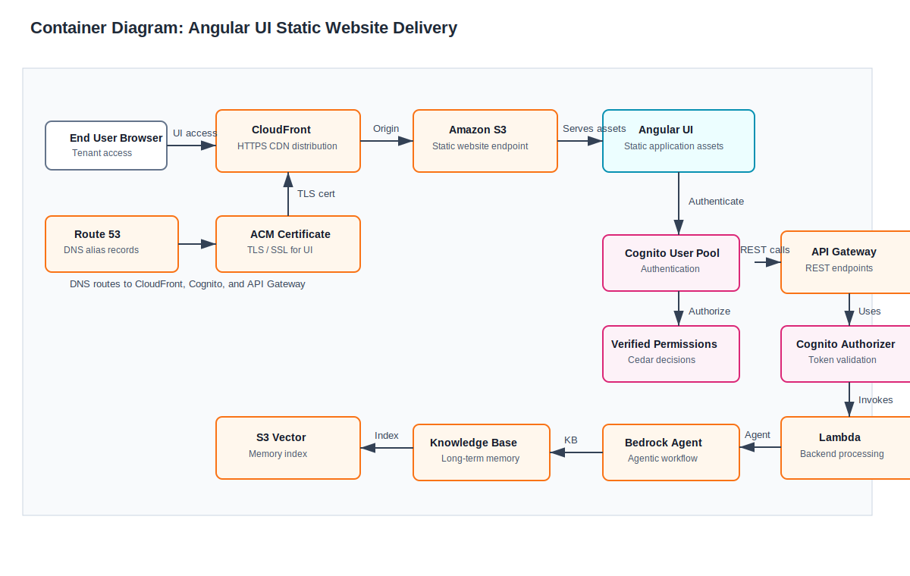

# Architecture Diagrams

This directory stores editable Draw.io architecture artifacts.

## Diagrams

- [context-diagram.drawio](context-diagram.drawio): System context for tenant access, authentication, and authorization.
- [container-diagram.drawio](container-diagram.drawio): Container view for Angular UI static website delivery through CloudFront and S3.

## SVG Previews

The SVG previews below let GitHub reviewers view the architecture without opening Draw.io.

### Context Diagram

### Container Diagram

## Draw.io Authoring Standards

Use the latest AWS 2026 icon set available in Draw.io for AWS services whenever a corresponding service icon exists.

Architecture diagrams should follow this style:

- Use an AWS Cloud group/container to show the AWS system boundary.
- Use AWS service icons for services such as CloudFront, S3, Cognito, API Gateway, Lambda, Route 53, Certificate Manager, Verified Permissions, Bedrock, and related memory/storage services.
- Use an external users icon for end users or tenant users outside the AWS boundary.
- Use simple directional connectors with concise labels for request, authorization, and data/memory flows.
- Use short callout boxes for important architecture guidance, assumptions, or deferred decisions.
- Avoid generic rounded rectangles for AWS services when an AWS 2026 icon exists.
- Keep editable `.drawio` sources and exported SVG previews together under `/architecture`.

The Draw.io XML example provided in `multi-tenant-agentic-ai-saas-reference-architecture.drawio` should be treated as a few-shot style reference for future diagram updates: AWS Cloud boundary, AWS service icons, direct flow arrows, and small explanatory callouts.

## Preview Images

Draw.io source files are editable artifacts. Exported SVG preview images should be maintained beside each `.drawio` file and referenced from Markdown so GitHub reviewers can view diagrams without opening Draw.io.

Preferred preview format: SVG.

SVG is preferred because architecture diagrams contain text, icons, boxes, and connectors that should remain sharp at any zoom level. JPG should be avoided for diagrams unless a downstream tool specifically requires a raster image.

## Validation Notes

Current validation result:

- `context-diagram.drawio` and `container-diagram.drawio` are valid editable Draw.io XML files.
- The current Draw.io sources do not yet use AWS icon shape styles such as `mxgraph.aws*`; they use generic Draw.io shapes with AWS service labels.
- The local environment used for this update did not have the Draw.io desktop/CLI exporter available on `PATH`, so the SVG previews were generated as repository preview artifacts from the diagram content rather than exported by the Draw.io application.

Next diagram refactor:

- Replace generic AWS service shapes in the `.drawio` sources with the latest AWS 2026 Open Library icons.
- Re-export the SVG previews from Draw.io after the icon refactor.
